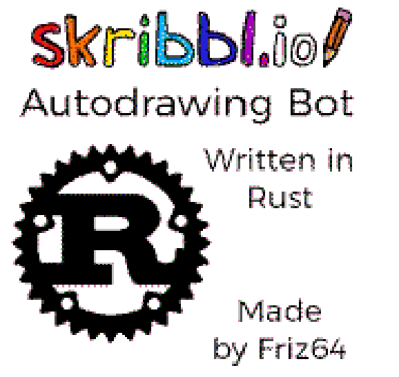

# skribbliobot

A drawing bot for skribblio written in Rust supporting

- Image searcher
- Dithered, Checkerboard style or grayscale drawing

Example Drawing|GUI
-|-
|
  
## Running

- Download the latest `skribbliobot` from the github releases
- Install `xclip`
- Start the bot
- Take a screenshot of your game screen and paste it into gimp
- Hover your cursor over the top left of the drawing canvas and note down XY (bottom of gimp)
- Select the drawing canvas with box select and note down the size of it (bottom of gimp)
- Repeat the last two steps for only the white color of the color palette
- Click the Save Settings button.

## Using

You have two options for image selection:

- Copy an image to the clipboard and don't select anything in the search results
- Select image in the search results

Click the Run Drawer button to draw the image to skribbl.io